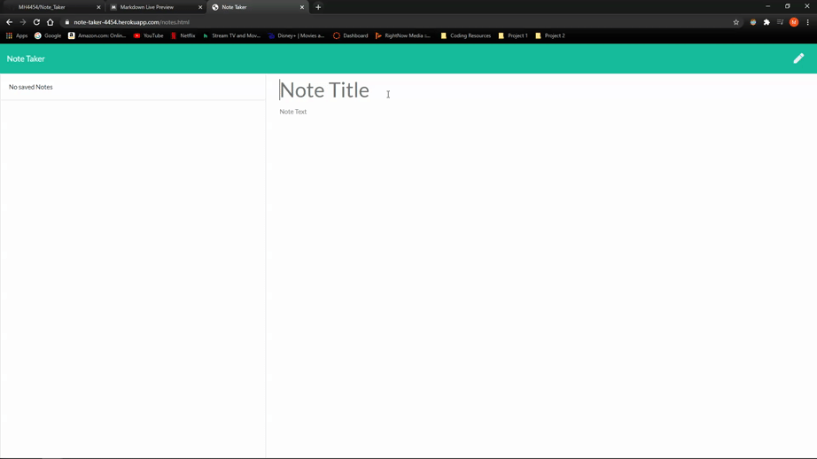

# Note Taker  
 
  


Users can save notes, delete notes and access previously saved notes.
<br>
Deployed site: [Note Taker](https://note-taker-4454.herokuapp.com/notes.html)

## Table of Contents:
* [Installation](#installation)
* [Usage](#usage)
* [License](#license)
* [Contributing](#contributing)
* [Tests](#tests)
* [Questions](#questions)

### Demo:


### Installation:
In order to install the necessary dependencies, open the console and run the following:
```npm install```

### Usage:
1. Click Get Started in deployed app.
1. Click + in the upper right to create a new note.
1. Enter note title andtext and click 💾 save.
1. Saved notes will appear in left column - click a saved note to 👀 view it.
1. Click the 🗑️ icon next to any saved note to delete it.

### Contributing:

Create a new pull request

1. Fork this repository
1. Create a new branch
1. Commit/push your changes
1. Create a new pull request


### Questions:
If you have any questions contact me on [GitHub](https://github.com/MH4454) or contact at MH4454@gmail.com


